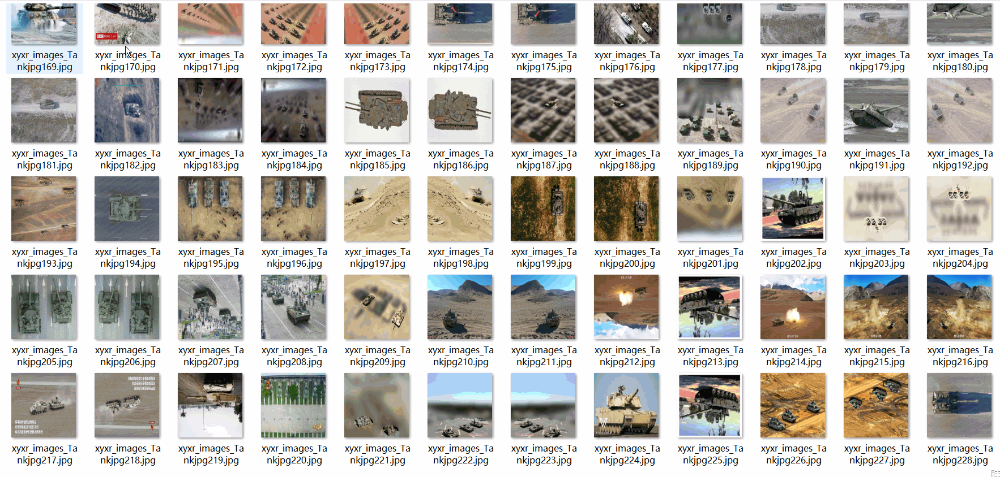
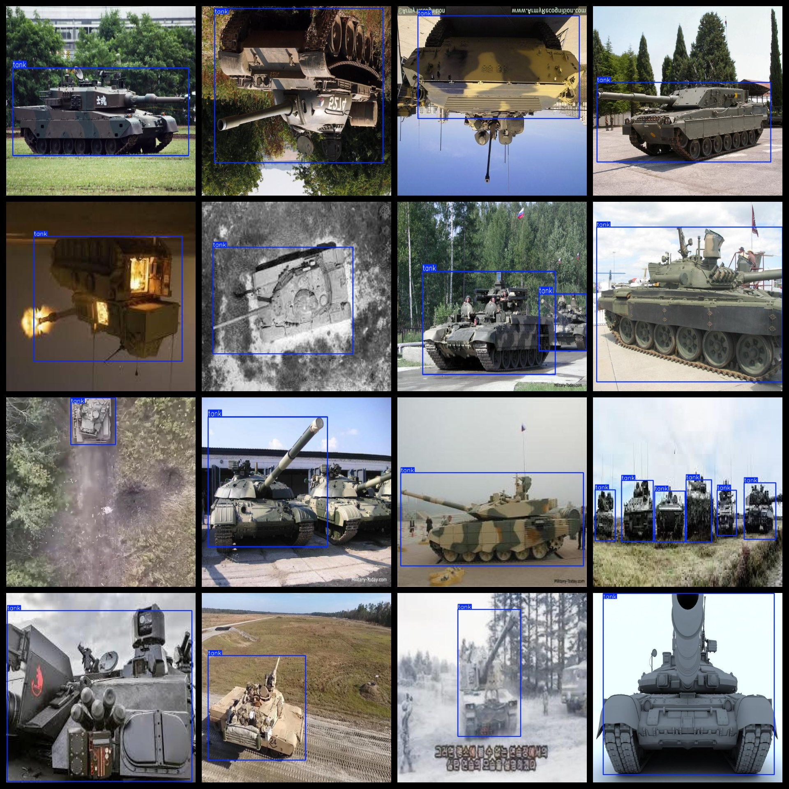

# This is a dataset of 11,613 images from the VOC+ format.

Dataset format: Pascal VOC format + YOLO format (excluding split paths in txt files, only including jpeg images and corresponding VOC format xml files and yolo format txt files)

Number of images (jpg file count): 11613

Number of annotations (xml file count): 11613

Number of annotations (txt file count): 11613

Number of annotation categories: 1

Repository location: datasets_sl

Annotation category name: ["tank"]

Number of bounding boxes for each category:

- Tank bounding box count = 16227
- Total bounding boxes = 16227
- Number of images per category:
- Tank images = 11613
- Image resolution: 640x640

Annotation tool used: labelImg

Dataset enhancement status: Yes

Annotation rules: Draw rectangular boxes for the category

Important notice: The dataset does not have a separate training, validation, or test set; users must divide it themselves.

Special declaration: This dataset does not guarantee the accuracy of the trained model or weight files.

Annotation and image details are as follows:

## Images

---

Here is a pay link on Stripe (https://buy.stripe.com/3cs8yP7sY87d0vu9AB). Please contact me lonlonago@foxmail.com after funding $89, and I will send you a complete data files, thank you!

